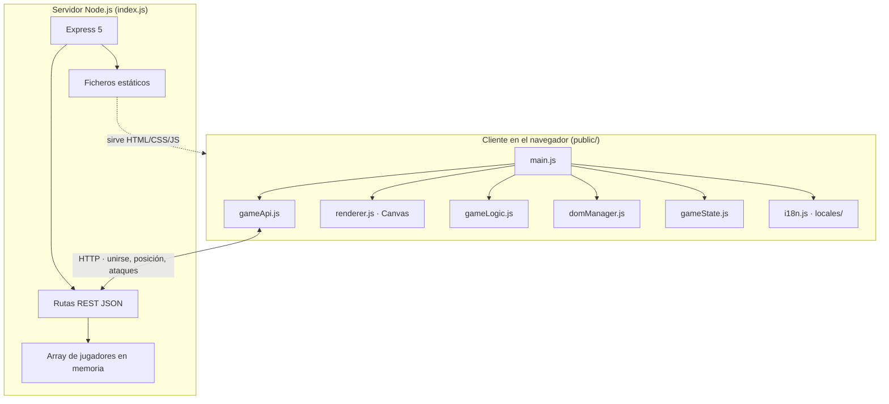
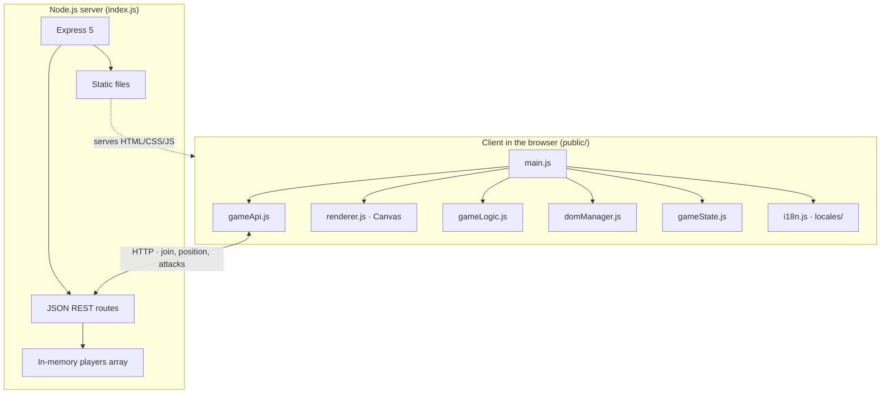
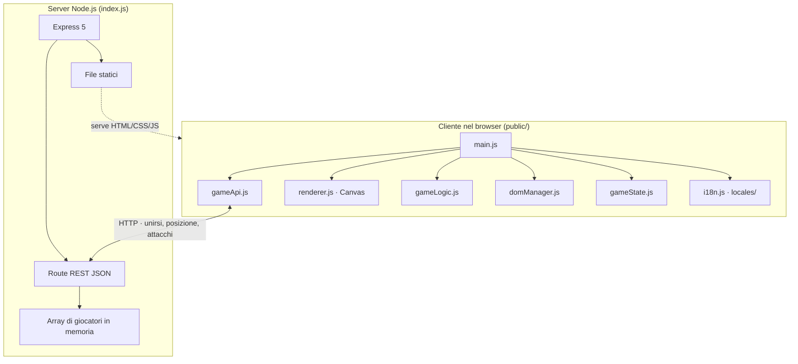

# NBAMON

[](https://nodejs.org/)
[](https://expressjs.com/)
[](https://developer.mozilla.org/en-US/docs/Web/JavaScript)
[](https://developer.mozilla.org/en-US/docs/Web/HTML)
[](https://developer.mozilla.org/en-US/docs/Web/CSS)
[](https://developer.mozilla.org/en-US/docs/Web/API/Canvas_API)
[](https://www.i18next.com/)
[](https://github.com/expressjs/cors)

[](https://vitest.dev/)
[](https://github.com/dequelabs/axe-core)

[](https://eslint.org/)
[](https://prettier.io/)
[](https://stylelint.io/)
[](https://editorconfig.org/)
[](https://cspell.org/)
[](https://html-validate.org/)
[](https://npmpackagejsonlint.org/)

[](https://pnpm.io/)
[](https://typicode.github.io/husky/)
[](https://github.com/lint-staged/lint-staged)
[](https://knip.dev/)
[](https://github.com/sverweij/dependency-cruiser)
[](https://github.com/dependabot)
[](https://render.com/)

[Español](#-espanol) | [English](#-english) | [Italiano](#-italiano)

---

## <a id="-espanol"></a>Español

### Descripción

Nbamon es un juego multijugador online temático de la NBA, inspirado en Pokémon. Los jugadores eligen un personaje NBA, se mueven por un mapa interactivo renderizado con Canvas y, al colisionar con otro jugador, entran en un combate por turnos estilo piedra-papel-tijeras al mejor de 5 rondas.

Este proyecto nació hace aproximadamente 3 años como un ejercicio de aprendizaje. Desde entonces ha sido progresivamente mejorado con herramientas de calidad de código, internacionalización, tests de accesibilidad, y una arquitectura más limpia. Nbamon cuenta la historia de un desarrollador que empezó sin saber y fue aprendiendo sobre la marcha.

### Demo

**Jugar ahora:** [https://nbamon.gonzalopozo.dev/](https://nbamon.gonzalopozo.dev/)

> **Nota:** El proyecto está alojado en Render (plan gratuito). La primera carga puede tardar entre 30 y 60 segundos debido al cold start del servidor. Ten paciencia, merece la pena.


### Cómo jugar

- Haz clic en "Jugar" para unirte a la partida.
- Elige uno de los 6 personajes NBA disponibles (LeBron James, Damian Lillard, Giannis Antetokounmpo, Anthony Davis, Jimmy Butler, Kawhi Leonard).
- Muévete por el mapa usando las flechas del teclado, WASD o los botones en pantalla.
- Al colisionar con otro jugador (o un bot tras ~10 segundos sin oponente), se inicia el combate.
- Selecciona 5 ataques (MATE, PASE o TAPÓN) para la batalla. El sistema de combate es circular: **MATE > PASE > TAPÓN > MATE**. El primero en ganar 3 rondas gana el combate.

### Stack tecnológico

| Tecnología   | Versión / Detalle                           |
| ------------ | ------------------------------------------- |
| Node.js      | >= 20                                       |
| Express      | 5                                           |
| JavaScript   | Vanilla (ES Modules nativos, sin framework) |
| HTML5 Canvas | API de renderizado del mapa y personajes    |
| i18next      | Internacionalización (ES, EN, IT)           |
| CSS          | Variables CSS, temas claro/oscuro/sistema   |
| pnpm         | Gestor de paquetes                          |

### Requisitos previos

- [Node.js](https://nodejs.org/) >= 20
- [pnpm](https://pnpm.io/) (recomendado) o npm

### Instalación

```bash
# Clonar el repositorio
git clone https://github.com/gonzalopozo/Nbamon.git
cd Nbamon

# Instalar dependencias
pnpm install

# Crear archivo de variables de entorno
cp .env.example .env

# Iniciar el servidor
pnpm start
```

El servidor arrancará en `http://localhost:3000` (o el puerto definido en `.env`).

### Scripts disponibles

| Comando                    | Descripción                                          |
| -------------------------- | ---------------------------------------------------- |
| `pnpm start`               | Inicia el servidor Express                           |
| `pnpm test`                | Ejecuta los tests con Vitest                         |
| `pnpm lint`                | Analiza el código JS con ESLint                      |
| `pnpm lint:fix`            | Corrige errores de ESLint automáticamente            |
| `pnpm lint:css`            | Analiza los archivos CSS con Stylelint               |
| `pnpm lint:css:fix`        | Corrige errores de Stylelint automáticamente         |
| `pnpm lint:html`           | Valida el HTML con html-validate                     |
| `pnpm lint:package`        | Valida el package.json con npm-package-json-lint     |
| `pnpm format`              | Formatea el código con Prettier                      |
| `pnpm format:check`        | Verifica el formato sin modificar archivos           |
| `pnpm spell`               | Revisa la ortografía con cspell                      |
| `pnpm spell:fix`           | Corrige errores ortográficos automáticamente         |
| `pnpm knip`                | Detecta código y dependencias no utilizadas          |
| `pnpm knip:fix`            | Elimina exports no utilizados automáticamente        |
| `pnpm knip:production`     | Detecta código no utilizado (solo producción)        |
| `pnpm depcruise`           | Valida las reglas de dependencias                    |
| `pnpm depcruise:graph`     | Genera grafo de dependencias (Mermaid)               |
| `pnpm depcruise:graph:svg` | Genera grafo de dependencias (SVG)                   |
| `pnpm audit`               | Ejecuta auditoría de seguridad                       |
| `pnpm audit:fix`           | Corrige vulnerabilidades encontradas                 |
| `pnpm check-updates`       | Comprueba actualizaciones de dependencias            |
| `pnpm update:latest`       | Actualiza todas las dependencias a su última versión |
| `pnpm prepare`             | Configura los hooks de Husky                         |

### Estructura del proyecto

```
Nbamon/
├── index.js                     # Servidor Express, API REST, modelos
├── package.json
├── .env.example
├── public/                      # Cliente (servido estáticamente)
│   ├── index.html
│   ├── style.css
│   ├── js/
│   │   ├── main.js              # Punto de entrada, orquestación
│   │   ├── api/gameApi.js       # Llamadas HTTP al servidor
│   │   ├── canvas/renderer.js   # Renderizado del mapa, movimiento, colisiones
│   │   ├── game/gameLogic.js    # Lógica de combate
│   │   ├── state/gameState.js   # Estado del juego
│   │   ├── data/players.js      # Definición de Nbamones
│   │   ├── dom/domManager.js    # Manipulación del DOM
│   │   ├── config/constants.js  # Constantes (tamaño del mapa, intervalos)
│   │   ├── i18n/i18n.js         # Configuración de i18next
│   │   └── theme/               # Gestión de temas (claro/oscuro)
│   ├── locales/                 # Traducciones (es.json, en.json, it.json)
│   └── assets/                  # Imágenes, sprites, iconos
├── tests/                       # Tests (Vitest)
│   ├── gamelogic.test.js        # Tests de lógica de combate
│   ├── renderer.test.js         # Tests de colisiones
│   └── a11y.test.js             # Tests de accesibilidad (axe-core)
└── .github/
    └── dependabot.yml           # Configuración de Dependabot
```

### Arquitectura

Nbamon sigue una arquitectura **cliente-servidor** sencilla:

- **Servidor** (`index.js`): Express 5 sirve los archivos estáticos del cliente y expone una API REST para gestionar jugadores, posiciones y combates. El estado de los jugadores se mantiene **en memoria** (sin base de datos).
- **Cliente** (`public/`): Una Single Page Application construida con Vanilla JS usando ES Modules nativos (sin bundler). El mapa se renderiza con Canvas API y el estado se gestiona con un objeto JavaScript plano.
- **Comunicación**: El cliente hace polling al servidor para detectar enemigos cercanos y obtener los ataques del oponente durante el combate.

**Endpoints de la API:**

| Endpoint                      | Método | Función                                        |
| ----------------------------- | ------ | ---------------------------------------------- |
| `/unirse`                     | GET    | Unirse a la partida (devuelve UUID)            |
| `/nbamon/:jugadorId`          | POST   | Registrar personaje elegido                    |
| `/nbamon/:jugadorId/posicion` | POST   | Actualizar posición, recibir enemigos cercanos |
| `/nbamon/:jugadorId/ataques`  | POST   | Enviar los 5 ataques seleccionados             |
| `/nbamon/:jugadorId/ataques`  | GET    | Obtener ataques del oponente (polling)         |



### Decisiones técnicas

**JavaScript Vanilla en lugar de un framework:** nbamon empezó como un proyecto de aprendizaje. Usar Vanilla JS fue una decisión consciente para entender los fundamentos del lenguaje, el DOM y la Canvas API sin abstracciones. Tres años después, el código ha sido refactorizado y modularizado en ES Modules, pero la esencia sigue siendo la misma: JavaScript puro.

**Express 5:** express es el framework de servidor minimalista por excelencia en Node.js. La versión 5 se eligió para aprovechar las mejoras en manejo de errores asíncronos y rutas. Para un juego con una API REST sencilla, Express es más que suficiente.

**Sin bundler (ES Modules nativos):** el cliente carga los módulos directamente con `import` nativo del navegador. Esto elimina la complejidad de Webpack/Vite/Rollup y mantiene el proyecto simple. Para un proyecto de este tamaño, la ganancia de rendimiento de un bundler no justifica la complejidad añadida.

**Estado en memoria (sin base de datos):** las partidas son efímeras. No hay necesidad de persistir datos entre reinicios del servidor. Un simple array en memoria es suficiente y elimina la dependencia de una base de datos externa.

**i18next para internacionalización:** el juego soporta tres idiomas (español, inglés e italiano). i18next es una biblioteca madura y ligera que permite gestionar traducciones sin complicaciones.

**Obsesión por la calidad del código:** este proyecto usa una cantidad deliberadamente alta de herramientas de linting y validación. No porque sea estrictamente necesario para un juego pequeño, sino como ejercicio de aprendizaje sobre mejores prácticas. Cada herramienta añade una capa de confianza sobre el código.

**Vitest:** framework de testing rápido y moderno, con soporte nativo para ES Modules. Al no usar bundler ni transpilador, era imprescindible un test runner que entendiese `import`/`export` sin configuración extra. Vitest cumple eso y además ofrece una API compatible con Jest, tiempos de ejecución muy bajos y buena integración con jsdom para tests de DOM y accesibilidad.

**pnpm:** gestor de dependencias más estricto y eficiente que npm. Su `node_modules` basado en enlaces simbólicos evita el hoisting implícito, lo que obliga a declarar explícitamente cada dependencia. Además es más rápido en instalaciones y ocupa menos espacio en disco. El proyecto usa `pnpm-workspace.yaml` para gestionar overrides de seguridad.

**Dependabot:** configurado para actualizar dependencias automáticamente cada sábado, con PRs agrupadas por tipo (producción vs desarrollo). Esto mantiene el proyecto al día sin esfuerzo manual.

### Herramientas de calidad

| Herramienta               | Propósito                                                                                                                                                                                                          |
| ------------------------- | ------------------------------------------------------------------------------------------------------------------------------------------------------------------------------------------------------------------ |
| **ESLint**                | Linter de JavaScript. Configuración flat con `@eslint/js` recommended y `eslint-config-prettier` para evitar conflictos con Prettier. Reglas diferenciadas para servidor (CommonJS), cliente (ES Modules) y tests. |
| **Prettier**              | Formateador de código. Indentación de 4 espacios, punto y coma, comillas dobles.                                                                                                                                   |
| **Stylelint**             | Linter de CSS. Extiende `stylelint-config-standard` con patrones personalizados para propiedades y keyframes.                                                                                                      |
| **cspell**                | Corrector ortográfico multiidioma (ES, EN, IT). Diccionario personalizado con términos del proyecto.                                                                                                               |
| **html-validate**         | Validador de HTML contra estándares. Configurado con reglas recomendadas y excepciones específicas.                                                                                                                |
| **npm-package-json-lint** | Valida la estructura y convenciones del `package.json` (orden alfabético, formato de versiones, campos requeridos).                                                                                                |
| **Knip**                  | Detecta código muerto, dependencias no utilizadas y exports huérfanos.                                                                                                                                             |
| **dependency-cruiser**    | Valida reglas de dependencias entre módulos (sin circulares, sin imports servidor-cliente, sin dependencias deprecadas). Genera grafos de dependencias.                                                            |
| **Husky + lint-staged**   | Hooks de pre-commit que ejecutan automáticamente ESLint, Prettier, cspell, Stylelint y html-validate sobre los archivos modificados antes de cada commit.                                                          |
| **axe-core**              | Motor de testing de accesibilidad (WCAG 2.0 A/AA). Integrado en los tests con Vitest para validar que la interfaz cumple estándares de accesibilidad.                                                              |
| **EditorConfig**          | Garantiza configuración consistente del editor entre desarrolladores (indentación, charset, finales de línea).                                                                                                     |
| **Dependabot**            | Actualización automática de dependencias vía GitHub. Configurado con actualizaciones semanales los sábados, PRs agrupadas por tipo y zona horaria Europe/Madrid.                                                   |

### Licencia

Este proyecto no tiene licencia pública (`UNLICENSED`).

---

## <a id="-english"></a>English

### Description

Nbamon is an online multiplayer NBA-themed game inspired by Pokémon. Players choose an NBA character, move across an interactive map rendered with Canvas, and upon colliding with another player, enter a turn-based rock-paper-scissors-style combat (best of 5 rounds).

This project was born approximately 3 years ago as a learning exercise. Since then, it has been progressively improved with code quality tools, internationalization, accessibility tests, and a cleaner architecture. Nbamon tells the story of a developer who started without knowing much and kept learning along the way.

### Demo

**Play now:** [https://nbamon.gonzalopozo.dev/](https://nbamon.gonzalopozo.dev/)

> **Note:** The project is hosted on Render (free tier). The first load may take 30 to 60 seconds due to server cold start. Be patient, it's worth the wait.


### How to play

- Click "Jugar" (Play) to join a match.
- Choose one of 6 available NBA characters (LeBron James, Damian Lillard, Giannis Antetokounmpo, Anthony Davis, Jimmy Butler, Kawhi Leonard).
- Move around the map using arrow keys, WASD, or on-screen buttons.
- Upon colliding with another player (or a bot after ~10 seconds with no opponent), combat begins.
- Select 5 attacks (MATE, PASE, or TAPÓN) for the battle. The combat system is circular: **MATE > PASE > TAPÓN > MATE**. First to win 3 rounds wins the match.

### Tech stack

| Technology   | Version / Detail                          |
| ------------ | ----------------------------------------- |
| Node.js      | >= 20                                     |
| Express      | 5                                         |
| JavaScript   | Vanilla (native ES Modules, no framework) |
| HTML5 Canvas | Map and character rendering API           |
| i18next      | Internationalization (ES, EN, IT)         |
| CSS          | CSS variables, light/dark/system themes   |
| pnpm         | Package manager                           |

### Prerequisites

- [Node.js](https://nodejs.org/) >= 20
- [pnpm](https://pnpm.io/) (recommended) or npm

### Installation

```bash
# Clone the repository
git clone https://github.com/gonzalopozo/Nbamon.git
cd Nbamon

# Install dependencies
pnpm install

# Create environment variables file
cp .env.example .env

# Start the server
pnpm start
```

The server will start at `http://localhost:3000` (or the port defined in `.env`).

### Available scripts

| Command                    | Description                                      |
| -------------------------- | ------------------------------------------------ |
| `pnpm start`               | Start the Express server                         |
| `pnpm test`                | Run tests with Vitest                            |
| `pnpm lint`                | Analyze JS code with ESLint                      |
| `pnpm lint:fix`            | Auto-fix ESLint errors                           |
| `pnpm lint:css`            | Analyze CSS files with Stylelint                 |
| `pnpm lint:css:fix`        | Auto-fix Stylelint errors                        |
| `pnpm lint:html`           | Validate HTML with html-validate                 |
| `pnpm lint:package`        | Validate package.json with npm-package-json-lint |
| `pnpm format`              | Format code with Prettier                        |
| `pnpm format:check`        | Check formatting without modifying files         |
| `pnpm spell`               | Check spelling with cspell                       |
| `pnpm spell:fix`           | Auto-fix spelling errors                         |
| `pnpm knip`                | Detect unused code and dependencies              |
| `pnpm knip:fix`            | Auto-remove unused exports                       |
| `pnpm knip:production`     | Detect unused code (production only)             |
| `pnpm depcruise`           | Validate dependency rules                        |
| `pnpm depcruise:graph`     | Generate dependency graph (Mermaid)              |
| `pnpm depcruise:graph:svg` | Generate dependency graph (SVG)                  |
| `pnpm audit`               | Run security audit                               |
| `pnpm audit:fix`           | Fix found vulnerabilities                        |
| `pnpm check-updates`       | Check for dependency updates                     |
| `pnpm update:latest`       | Update all dependencies to latest version        |
| `pnpm prepare`             | Set up Husky git hooks                           |

### Project structure

```
Nbamon/
├── index.js                     # Express server, REST API, models
├── package.json
├── .env.example
├── public/                      # Client (served statically)
│   ├── index.html
│   ├── style.css
│   ├── js/
│   │   ├── main.js              # Entry point, orchestration
│   │   ├── api/gameApi.js       # HTTP calls to server
│   │   ├── canvas/renderer.js   # Map rendering, movement, collisions
│   │   ├── game/gameLogic.js    # Combat logic
│   │   ├── state/gameState.js   # Game state
│   │   ├── data/players.js      # Nbamon definitions
│   │   ├── dom/domManager.js    # DOM manipulation
│   │   ├── config/constants.js  # Constants (map size, intervals)
│   │   ├── i18n/i18n.js         # i18next configuration
│   │   └── theme/               # Theme management (light/dark)
│   ├── locales/                 # Translations (es.json, en.json, it.json)
│   └── assets/                  # Images, sprites, icons
├── tests/                       # Tests (Vitest)
│   ├── gamelogic.test.js        # Combat logic tests
│   ├── renderer.test.js         # Collision tests
│   └── a11y.test.js             # Accessibility tests (axe-core)
└── .github/
    └── dependabot.yml           # Dependabot configuration
```

### Architecture

Nbamon follows a simple **client-server** architecture:

- **Server** (`index.js`): Express 5 serves static client files and exposes a REST API to manage players, positions, and combats. Player state is kept **in memory** (no database).
- **Client** (`public/`): A Single Page Application built with Vanilla JS using native ES Modules (no bundler). The map is rendered with Canvas API and state is managed with a plain JavaScript object.
- **Communication**: The client polls the server to detect nearby enemies and fetch the opponent's attacks during combat.

**API Endpoints:**

| Endpoint                      | Method | Purpose                                 |
| ----------------------------- | ------ | --------------------------------------- |
| `/unirse`                     | GET    | Join the match (returns UUID)           |
| `/nbamon/:jugadorId`          | POST   | Register chosen character               |
| `/nbamon/:jugadorId/posicion` | POST   | Update position, receive nearby enemies |
| `/nbamon/:jugadorId/ataques`  | POST   | Submit 5 selected attacks               |
| `/nbamon/:jugadorId/ataques`  | GET    | Fetch opponent's attacks (polling)      |



### Technical decisions

**Vanilla JavaScript instead of a framework:** nbamon started as a learning project. Using Vanilla JS was a conscious decision to understand the fundamentals of the language, the DOM, and the Canvas API without abstractions. Three years later, the code has been refactored and modularized into ES Modules, but the essence remains the same: pure JavaScript.

**Express 5:** express is the quintessential minimalist server framework for Node.js. Version 5 was chosen to take advantage of improvements in async error handling and routing. For a game with a simple REST API, Express is more than enough.

**No bundler (native ES Modules):** the client loads modules directly using the browser's native `import`. This eliminates the complexity of Webpack/Vite/Rollup and keeps the project simple. For a project of this size, the performance gain of a bundler doesn't justify the added complexity.

**In-memory state (no database):** game sessions are ephemeral. There is no need to persist data between server restarts. A simple in-memory array is sufficient and eliminates the dependency on an external database.

**i18next for internationalization:** the game supports three languages (Spanish, English, and Italian). i18next is a mature, lightweight library that handles translations without complications.

**Code quality obsession:** this project uses a deliberately high number of linting and validation tools. Not because it's strictly necessary for a small game, but as a learning exercise about best practices. Each tool adds a layer of confidence about the code.

**Vitest:** a fast, modern testing framework with native ES Modules support. Since the project uses no bundler or transpiler, it was essential to have a test runner that understands `import`/`export` out of the box. Vitest delivers that plus a Jest-compatible API, very low execution times, and smooth integration with jsdom for DOM and accessibility tests.

**pnpm:** a stricter and more efficient package manager than npm. Its symlink-based `node_modules` prevents implicit hoisting, forcing every dependency to be explicitly declared. It's also faster to install and uses less disk space. The project uses `pnpm-workspace.yaml` to manage security overrides.

**Dependabot:** configured to automatically update dependencies every Saturday, with PRs grouped by type (production vs development). This keeps the project up to date without manual effort.

### Quality tools

| Tool                      | Purpose                                                                                                                                                                                                 |
| ------------------------- | ------------------------------------------------------------------------------------------------------------------------------------------------------------------------------------------------------- |
| **ESLint**                | JavaScript linter. Flat config with `@eslint/js` recommended and `eslint-config-prettier` to avoid conflicts with Prettier. Differentiated rules for server (CommonJS), client (ES Modules), and tests. |
| **Prettier**              | Code formatter. 4-space indentation, semicolons, double quotes.                                                                                                                                         |
| **Stylelint**             | CSS linter. Extends `stylelint-config-standard` with custom patterns for properties and keyframes.                                                                                                      |
| **cspell**                | Multilingual spell checker (ES, EN, IT). Custom dictionary with project-specific terms.                                                                                                                 |
| **html-validate**         | HTML validator against standards. Configured with recommended rules and specific exceptions.                                                                                                            |
| **npm-package-json-lint** | Validates `package.json` structure and conventions (alphabetical order, version format, required fields).                                                                                               |
| **Knip**                  | Detects dead code, unused dependencies, and orphan exports.                                                                                                                                             |
| **dependency-cruiser**    | Validates dependency rules between modules (no circular, no server-client imports, no deprecated dependencies). Generates dependency graphs.                                                            |
| **Husky + lint-staged**   | Pre-commit hooks that automatically run ESLint, Prettier, cspell, Stylelint, and html-validate on modified files before each commit.                                                                    |
| **axe-core**              | Accessibility testing engine (WCAG 2.0 A/AA). Integrated into Vitest tests to validate the interface meets accessibility standards.                                                                     |
| **EditorConfig**          | Ensures consistent editor configuration across developers (indentation, charset, line endings).                                                                                                         |
| **Dependabot**            | Automatic dependency updates via GitHub. Configured with weekly Saturday updates, grouped PRs by type, and Europe/Madrid timezone.                                                                      |

### License

This project has no public license (`UNLICENSED`).

---

## <a id="-italiano"></a>Italiano

### Descrizione

Nbamon è un gioco multiplayer online a tema NBA, ispirato a Pokémon. I giocatori scelgono un personaggio NBA, si muovono su una mappa interattiva renderizzata con Canvas e, quando collidono con un altro giocatore, entrano in un combattimento a turni stile sasso-carta-forbice al meglio delle 5 manche.

Questo progetto è nato circa 3 anni fa come esercizio di apprendimento. Da allora è stato progressivamente migliorato con strumenti di qualità del codice, internazionalizzazione, test di accessibilità e un'architettura più pulita. Nbamon racconta la storia di uno sviluppatore che ha iniziato senza sapere molto e ha continuato a imparare lungo il cammino.

### Demo

**Gioca ora:** [https://nbamon.gonzalopozo.dev/](https://nbamon.gonzalopozo.dev/)

> **Nota:** Il progetto è ospitato su Render (piano gratuito). Il primo caricamento può richiedere da 30 a 60 secondi a causa del cold start del server. Sii paziente, ne vale la pena.

<!-- TODO: Sostituire con un GIF reale del gameplay -->


### Come giocare

- Clicca su "Jugar" (Gioca) per unirti a una partita.
- Scegli uno dei 6 personaggi NBA disponibili (LeBron James, Damian Lillard, Giannis Antetokounmpo, Anthony Davis, Jimmy Butler, Kawhi Leonard).
- Muoviti sulla mappa usando i tasti freccia, WASD o i pulsanti sullo schermo.
- Quando collidi con un altro giocatore (o un bot dopo ~10 secondi senza avversario), inizia il combattimento.
- Seleziona 5 attacchi (MATE, PASE o TAPÓN) per la battaglia. Il sistema di combattimento è circolare: **MATE > PASE > TAPÓN > MATE**. Il primo a vincere 3 manche vince il combattimento.

### Stack tecnologico

| Tecnologia   | Versione / Dettaglio                          |
| ------------ | --------------------------------------------- |
| Node.js      | >= 20                                         |
| Express      | 5                                             |
| JavaScript   | Vanilla (ES Modules nativi, nessun framework) |
| HTML5 Canvas | API di rendering della mappa e dei personaggi |
| i18next      | Internazionalizzazione (ES, EN, IT)           |
| CSS          | Variabili CSS, temi chiaro/scuro/sistema      |
| pnpm         | Gestore di pacchetti                          |

### Prerequisiti

- [Node.js](https://nodejs.org/) >= 20
- [pnpm](https://pnpm.io/) (raccomandato) o npm

### Installazione

```bash
# Clona il repository
git clone https://github.com/gonzalopozo/Nbamon.git
cd Nbamon

# Installa le dipendenze
pnpm install

# Crea il file delle variabili d'ambiente
cp .env.example .env

# Avvia il server
pnpm start
```

Il server si avvierà su `http://localhost:3000` (o la porta definita in `.env`).

### Script disponibili

| Comando                    | Descrizione                                       |
| -------------------------- | ------------------------------------------------- |
| `pnpm start`               | Avvia il server Express                           |
| `pnpm test`                | Esegue i test con Vitest                          |
| `pnpm lint`                | Analizza il codice JS con ESLint                  |
| `pnpm lint:fix`            | Corregge automaticamente gli errori di ESLint     |
| `pnpm lint:css`            | Analizza i file CSS con Stylelint                 |
| `pnpm lint:css:fix`        | Corregge automaticamente gli errori di Stylelint  |
| `pnpm lint:html`           | Valida l'HTML con html-validate                   |
| `pnpm lint:package`        | Valida il package.json con npm-package-json-lint  |
| `pnpm format`              | Formatta il codice con Prettier                   |
| `pnpm format:check`        | Verifica la formattazione senza modificare i file |
| `pnpm spell`               | Controlla l'ortografia con cspell                 |
| `pnpm spell:fix`           | Corregge automaticamente gli errori ortografici   |
| `pnpm knip`                | Rileva codice e dipendenze non utilizzate         |
| `pnpm knip:fix`            | Rimuove automaticamente gli export non utilizzati |
| `pnpm knip:production`     | Rileva codice non utilizzato (solo produzione)    |
| `pnpm depcruise`           | Valida le regole delle dipendenze                 |
| `pnpm depcruise:graph`     | Genera il grafo delle dipendenze (Mermaid)        |
| `pnpm depcruise:graph:svg` | Genera il grafo delle dipendenze (SVG)            |
| `pnpm audit`               | Esegue l'audit di sicurezza                       |
| `pnpm audit:fix`           | Corregge le vulnerabilità trovate                 |
| `pnpm check-updates`       | Controlla gli aggiornamenti delle dipendenze      |
| `pnpm update:latest`       | Aggiorna tutte le dipendenze all'ultima versione  |
| `pnpm prepare`             | Configura gli hook di Husky                       |

### Struttura del progetto

```
Nbamon/
├── index.js                     # Server Express, API REST, modelli
├── package.json
├── .env.example
├── public/                      # Client (servito staticamente)
│   ├── index.html
│   ├── style.css
│   ├── js/
│   │   ├── main.js              # Punto di ingresso, orchestrazione
│   │   ├── api/gameApi.js       # Chiamate HTTP al server
│   │   ├── canvas/renderer.js   # Rendering della mappa, movimento, collisioni
│   │   ├── game/gameLogic.js    # Logica di combattimento
│   │   ├── state/gameState.js   # Stato del gioco
│   │   ├── data/players.js      # Definizioni degli Nbamon
│   │   ├── dom/domManager.js    # Manipolazione del DOM
│   │   ├── config/constants.js  # Costanti (dimensione mappa, intervalli)
│   │   ├── i18n/i18n.js         # Configurazione di i18next
│   │   └── theme/               # Gestione dei temi (chiaro/scuro)
│   ├── locales/                 # Traduzioni (es.json, en.json, it.json)
│   └── assets/                  # Immagini, sprite, icone
├── tests/                       # Test (Vitest)
│   ├── gamelogic.test.js        # Test della logica di combattimento
│   ├── renderer.test.js         # Test delle collisioni
│   └── a11y.test.js             # Test di accessibilità (axe-core)
└── .github/
    └── dependabot.yml           # Configurazione di Dependabot
```

### Architettura

Nbamon segue un'architettura **client-server** semplice:

- **Server** (`index.js`): Express 5 serve i file statici del client e espone un'API REST per gestire giocatori, posizioni e combattimenti. Lo stato dei giocatori è mantenuto **in memoria** (nessun database).
- **Client** (`public/`): Una Single Page Application costruita con Vanilla JS usando ES Modules nativi (senza bundler). La mappa è renderizzata con Canvas API e lo stato è gestito con un semplice oggetto JavaScript.
- **Comunicazione**: Il client effettua polling al server per rilevare nemici vicini e ottenere gli attacchi dell'avversario durante il combattimento.

**Endpoint dell'API:**

| Endpoint                      | Metodo | Funzione                                        |
| ----------------------------- | ------ | ----------------------------------------------- |
| `/unirse`                     | GET    | Unirsi alla partita (restituisce UUID)          |
| `/nbamon/:jugadorId`          | POST   | Registrare il personaggio scelto                |
| `/nbamon/:jugadorId/posicion` | POST   | Aggiornare la posizione, ricevere nemici vicini |
| `/nbamon/:jugadorId/ataques`  | POST   | Inviare i 5 attacchi selezionati                |
| `/nbamon/:jugadorId/ataques`  | GET    | Ottenere gli attacchi dell'avversario (polling) |



### Decisioni tecniche

**JavaScript Vanilla invece di un framework:** nbamon è iniziato come progetto di apprendimento. Usare Vanilla JS è stata una decisione consapevole per capire i fondamenti del linguaggio, del DOM e della Canvas API senza astrazioni. Tre anni dopo, il codice è stato rifattorizzato e modularizzato in ES Modules, ma l'essenza rimane la stessa: JavaScript puro.

**Express 5:** express è il framework server minimalista per eccellenza in Node.js. La versione 5 è stata scelta per sfruttare i miglioramenti nella gestione degli errori asincroni e nel routing. Per un gioco con una semplice API REST, Express è più che sufficiente.

**Nessun bundler (ES Modules nativi):** il client carica i moduli direttamente usando l'`import` nativo del browser. Questo elimina la complessità di Webpack/Vite/Rollup e mantiene il progetto semplice. Per un progetto di queste dimensioni, il guadagno in prestazioni di un bundler non giustifica la complessità aggiunta.

**Stato in memoria (nessun database):** le sessioni di gioco sono effimere. Non c'è bisogno di persistere dati tra i riavvii del server. Un semplice array in memoria è sufficiente e elimina la dipendenza da un database esterno.

**i18next per l'internazionalizzazione:** il gioco supporta tre lingue (spagnolo, inglese e italiano). i18next è una libreria matura e leggera che gestisce le traduzioni senza complicazioni.

**Ossessione per la qualità del codice:** questo progetto usa un numero deliberatamente alto di strumenti di linting e validazione. Non perché sia strettamente necessario per un piccolo gioco, ma come esercizio di apprendimento sulle migliori pratiche. Ogni strumento aggiunge uno strato di fiducia sul codice.

**Vitest:** framework di testing veloce e moderno, con supporto nativo per ES Modules. Non usando bundler né transpiler, era indispensabile un test runner che capisse `import`/`export` senza configurazione aggiuntiva. Vitest offre esattamente questo, più un'API compatibile con Jest, tempi di esecuzione molto bassi e una buona integrazione con jsdom per test del DOM e di accessibilità.

**pnpm:** gestore di dipendenze più rigoroso ed efficiente di npm. Il suo `node_modules` basato su link simbolici evita l'hoisting implicito, obbligando a dichiarare esplicitamente ogni dipendenza. È anche più veloce nelle installazioni e occupa meno spazio su disco. Il progetto usa `pnpm-workspace.yaml` per gestire override di sicurezza.

**Dependabot:** configurato per aggiornare automaticamente le dipendenze ogni sabato, con PR raggruppate per tipo (produzione vs sviluppo). Questo mantiene il progetto aggiornato senza sforzo manuale.

### Strumenti di qualità

| Strumento                 | Scopo                                                                                                                                                                                                      |
| ------------------------- | ---------------------------------------------------------------------------------------------------------------------------------------------------------------------------------------------------------- |
| **ESLint**                | Linter JavaScript. Configurazione flat con `@eslint/js` recommended e `eslint-config-prettier` per evitare conflitti con Prettier. Regole differenziate per server (CommonJS), client (ES Modules) e test. |
| **Prettier**              | Formattatore di codice. Indentazione a 4 spazi, punto e virgola, virgolette doppie.                                                                                                                        |
| **Stylelint**             | Linter CSS. Estende `stylelint-config-standard` con pattern personalizzati per proprietà e keyframes.                                                                                                      |
| **cspell**                | Correttore ortografico multilingue (ES, EN, IT). Dizionario personalizzato con termini specifici del progetto.                                                                                             |
| **html-validate**         | Validatore HTML contro gli standard. Configurato con regole raccomandate e eccezioni specifiche.                                                                                                           |
| **npm-package-json-lint** | Valida la struttura e le convenzioni del `package.json` (ordine alfabetico, formato versioni, campi obbligatori).                                                                                          |
| **Knip**                  | Rileva codice morto, dipendenze non utilizzate e export orfani.                                                                                                                                            |
| **dependency-cruiser**    | Valida le regole delle dipendenze tra moduli (no circolari, no import server-client, no dipendenze deprecate). Genera grafi delle dipendenze.                                                              |
| **Husky + lint-staged**   | Hook pre-commit che eseguono automaticamente ESLint, Prettier, cspell, Stylelint e html-validate sui file modificati prima di ogni commit.                                                                 |
| **axe-core**              | Motore di testing dell'accessibilità (WCAG 2.0 A/AA). Integrato nei test con Vitest per validare che l'interfaccia soddisfi gli standard di accessibilità.                                                 |
| **EditorConfig**          | Garantisce una configurazione dell'editor coerente tra sviluppatori (indentazione, charset, fine riga).                                                                                                    |
| **Dependabot**            | Aggiornamento automatico delle dipendenze tramite GitHub. Configurato con aggiornamenti settimanali il sabato, PR raggruppate per tipo e fuso orario Europe/Madrid.                                        |

### Licenza

Questo progetto non ha una licenza pubblica (`UNLICENSED`).
